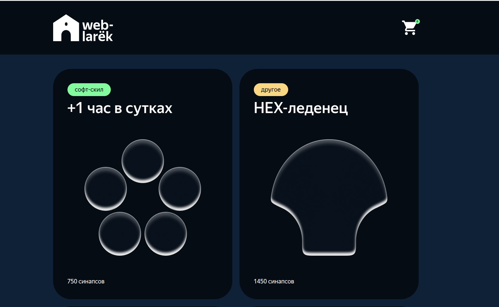
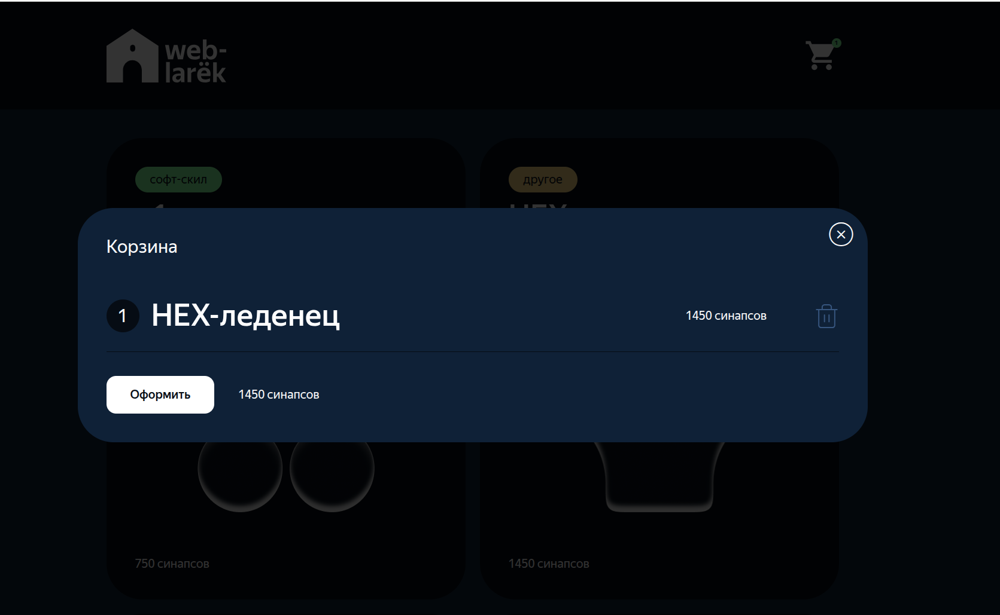
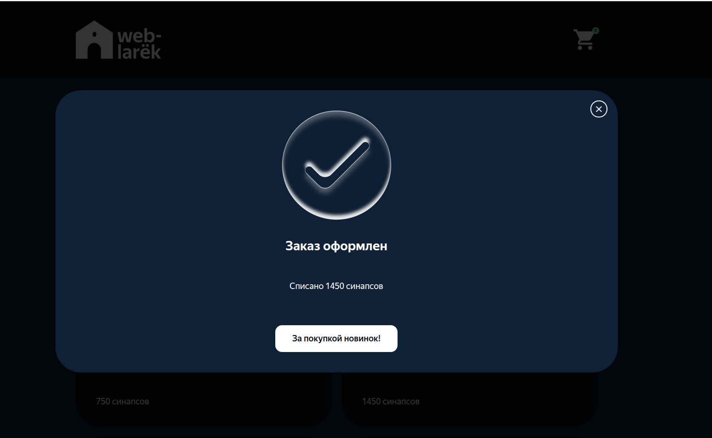

# Проектная работа "Веб-ларек"

Стек: HTML, SCSS, TS, Vite

Структура проекта:

- src/ — исходные файлы проекта
- src/components/ — папка с JS компонентами
- src/components/base/ — папка с базовым кодом

Важные файлы:

- index.html — HTML-файл главной страницы
- src/types/index.ts — файл с типами
- src/main.ts — точка входа приложения
- src/scss/styles.scss — корневой файл стилей
- src/utils/constants.ts — файл с константами
- src/utils/utils.ts — файл с утилитами

## Установка и запуск

Для установки и запуска проекта необходимо выполнить команды

```
npm install
npm run start
```

или

```
yarn
yarn start
```

## Сборка

```
npm run build
```

или

```
yarn build
```

# Интернет-магазин «Web-Larёk»

«Web-Larёk» — это интернет-магазин с товарами для веб-разработчиков, где пользователи могут просматривать товары, добавлять их в корзину и оформлять заказы. Сайт предоставляет удобный интерфейс с модальными окнами для просмотра деталей товаров, управления корзиной и выбора способа оплаты, обеспечивая полный цикл покупки с отправкой заказов на сервер.

## Архитектура приложения

Код приложения разделен на слои согласно парадигме MVP (Model-View-Presenter), которая обеспечивает четкое разделение ответственности между классами слоев Model и View. Каждый слой несет свой смысл и ответственность:

Model - слой данных, отвечает за хранение и изменение данных.  
View - слой представления, отвечает за отображение данных на странице.  
Presenter - презентер содержит основную логику приложения и отвечает за связь представления и данных.

Взаимодействие между классами обеспечивается использованием событийно-ориентированного подхода. Модели и Представления генерируют события при изменении данных или взаимодействии пользователя с приложением, а Презентер обрабатывает эти события используя методы как Моделей, так и Представлений.

### Базовый код

#### Класс Component

Является базовым классом для всех компонентов интерфейса.
Класс является дженериком и принимает в переменной `T` тип данных, которые могут быть переданы в метод `render` для отображения.

Конструктор:  
`constructor(container: HTMLElement)` - принимает ссылку на DOM элемент за отображение, которого он отвечает.

Поля класса:  
`container: HTMLElement` - поле для хранения корневого DOM элемента компонента.

Методы класса:  
`render(data?: Partial<T>): HTMLElement` - Главный метод класса. Он принимает данные, которые необходимо отобразить в интерфейсе, записывает эти данные в поля класса и возвращает ссылку на DOM-элемент. Предполагается, что в классах, которые будут наследоваться от `Component` будут реализованы сеттеры для полей с данными, которые будут вызываться в момент вызова `render` и записывать данные в необходимые DOM элементы.  
`setImage(element: HTMLImageElement, src: string, alt?: string): void` - утилитарный метод для модификации DOM-элементов ``

#### Класс Api

Содержит в себе базовую логику отправки запросов.

Конструктор:  
`constructor(baseUrl: string, options: RequestInit = {})` - В конструктор передается базовый адрес сервера и опциональный объект с заголовками запросов.

Поля класса:  
`baseUrl: string` - базовый адрес сервера  
`options: RequestInit` - объект с заголовками, которые будут использованы для запросов.

Методы:  
`get(uri: string): Promise<object>` - выполняет GET запрос на переданный в параметрах ендпоинт и возвращает промис с объектом, которым ответил сервер  
`post(uri: string, data: object, method: ApiPostMethods = 'POST'): Promise<object>` - принимает объект с данными, которые будут переданы в JSON в теле запроса, и отправляет эти данные на ендпоинт переданный как параметр при вызове метода. По умолчанию выполняется `POST` запрос, но метод запроса может быть переопределен заданием третьего параметра при вызове.  
`handleResponse(response: Response): Promise<object>` - защищенный метод проверяющий ответ сервера на корректность и возвращающий объект с данными полученный от сервера или отклоненный промис, в случае некорректных данных.

#### Класс EventEmitter

Брокер событий реализует паттерн "Наблюдатель", позволяющий отправлять события и подписываться на события, происходящие в системе. Класс используется для связи слоя данных и представления.

Конструктор класса не принимает параметров.

Поля класса:  
`_events: Map<string | RegExp, Set<Function>>)` - хранит коллекцию подписок на события. Ключи коллекции - названия событий или регулярное выражение, значения - коллекция функций обработчиков, которые будут вызваны при срабатывании события.

Методы класса:  
`on<T extends object>(event: EventName, callback: (data: T) => void): void` - подписка на событие, принимает название события и функцию обработчик.  
`emit<T extends object>(event: string, data?: T): void` - инициализация события. При вызове события в метод передается название события и объект с данными, который будет использован как аргумент для вызова обработчика.  
`trigger<T extends object>(event: string, context?: Partial<T>): (data: T) => void` - возвращает функцию, при вызове которой инициализируется требуемое в параметрах событие с передачей в него данных из второго параметра.

## Данные

В ходе анализа проекта было установлено: в приложении используются две сущности, которые описывают данные:

1. Товар
2. Покупатель

Их можно описать такими интерфейсами:

1.Товар, где id: string— идентификатор. description:строка — описание. image: string— ссылка на изображение товара. title: string— название товара. category: string— категория товара. price: number | null— цена товара. Может быть нулевым, тогда товар недоступен.

```
interface IProduct {
  id: string; // идентификатор товара
  description: string; // описание
  image: string; // ссылка на изображение
  title: string; // название товара
  category: string; // категория товара
  price: number | null; // цена (может быть null, тогда товар недоступен)
}
```

2. Покупатель, где payment: TPayment— выбранный способ оплаты («картой» или «наличными»). email: string— электронная почта покупателя. phone: string— номер телефона покупателя. address: string— адрес доставки заказа.

```
interface IBuyer {
  payment: TPayment;
  email: string;
  phone: string;
  address: string;
}
```

## Классы

Для учёта данных в приложении есть классы, которые разделены между собой по смыслу и зонам ответственности

### Класс Catalog:

Класс отвечает за хранение списка всех товаров, предоставленных API, а также за управление выбранным товаром для отображения подробной информации. Используется для работы с каталогом товаров в приложении.

Конструктор класса
Не принимает параметров. Инициализирует пустой массив товаров и значение выбранного товара null.

Поля класса:

`items: IProduct[]` – массив всех товаров.

`selectedItem: IProduct | null` – товар, выбранный для подробного отображения.

Методы класса:

`setItems(items: IProduct[]): void` – сохранение массива товаров полученного в параметрах метода.

`getItems(): IProduct[]` – получение массива товаров из модели.

`getItemById(id: string): IProduct | undefined` – возвращает товар по его id или undefined, если товар не найден.

`setSelectedItem(item: IProduct): void` – сохраняет выбранный товар для подробного отображения.

`getSelectedItem(): IProduct | null` – возвращает выбранный товар для подробного отображения.

### Класс Cart

Класс управляет корзиной покупателя. Отвечает за хранение товаров, которые пользователь добавил в корзину, и операции с ними.

Конструктор класса
Не принимает параметров. Инициализирует пустую корзину.

Поля класса:

`items: IProduct[]` – массив товаров, добавленных в корзину.

Методы класса:

`getItems(): IProduct[]` – получение массива товаров, которые находятся в корзине.

`addItem(item: IProduct): void` – добавление товара, который был получен в параметре, в массив корзины.

`removeItem(item: IProduct): void` – удаляет товар из корзины.

`clear(): void` – очищает корзину.

`getTotal(): number` – возвращает общую стоимость всех товаров в корзине.

`getCount(): number` – возвращает количество товаров в корзине.

`hasItem(item: IProduct): boolean` – проверяет, есть ли товар в корзине.
хранит массив товаров, выбранных покупателем для покупки.

### Класс Buyer

Класс хранит данные покупателя, необходимые для оформления заказа, и выполняет их валидацию.

Конструктор класса
Не принимает параметров. Инициализирует пустые данные покупателя.

Поля класса:

`payment: TPayment | null` – способ оплаты (card или cash).

`address: string` – адрес доставки.

`phone: string` – телефон покупателя.

`email: string` – email покупателя.

Методы класса:

`setDataBuyer(data: Partial<IBuyer>): void` – сохраняет переданные данные (одно или несколько полей), не удаляя уже существующие.

`getDataBuyer(): IBuyer` – возвращает все данные покупателя.

`clearDataBuyer(): void` – очищает все данные покупателя.

`valiDataBuyer(): Record<string, string>` – валидирует данные покупателя и возвращает объект с ошибками.

Пример возвращаемого объекта ошибок:
```
{
  "payment": "Не выбран вид оплаты",
  "email": "Укажите email"
}
```


## Слой коммуникации
### Класс ApiService
Этот класс является «прослойкой» между нашим приложением и сервером. Он использует уже готовый базовый класс Api, чтобы выполнять HTTP-запросы.

### Методы

getProducts(): Promise<IProduct[]>
Делает GET-запрос к эндпоинту /product/.
Возвращает массив товаров IProduct[].

postOrder(order: IOrder): Promise<IOrderResult>
Делает POST-запрос к эндпоинту /order/.
В параметре принимает объект заказа IOrder.
Возвращает результат IOrderResult (сумма, список id товаров).

### Типы

Каталог товаров который к нам приходит с сервера
```
interface ICatalogResult {
  total: number;      // всего товаров
  items: IProduct[];  // список товаров
}
```

Заказ, который отправляем на сервер
```
interface IOrder {
  payment: TPayment;
  email: string;
  phone: string;
  address: string;
  total: number;
  items: string[];   // список выбранных товаров (id)
}
```

Результат оформления заказа, который возвращает сервер после успешного запроса.

```
interface IOrderResult {
  id: string;
  total: number,     // итоговая сумма заказа
}
```
Список событий, которые мы будем обрабатывать:
  - catalog:changed      — каталог обновился (модель -> презентер)
  - card:select          — пользователь кликнул на карточку в каталоге (view -> презентер)
  - card:add             — пользователь нажал "В корзину" (view -> презентер)
  - card:remove          — пользователь нажал "удалить" в корзине (view -> презентер)
  - basket:open          — пользователь открыл корзину (view -> презентер)
  - order:open           — перейти к оформлению (view -> презентер)
  - form:change          — изменение в форме (view -> презентер)
  - form:submit          — форма отправлена (view -> презентер)
  - modal:close          — модалка закрыта (view -> презентер)
  // В дополнение — мы будем эмитить cart:changed и buyer:changed из презентера

  ## View (представление)

### Card (базовая карточка)
```
Поля:
title: string
price: number

Методы:
set title(value: string)
set price(value: number)
```

CardCatalog
```
Расширяет: Card
Назначение: карточка товара в каталоге.
Доп. поля:
category: string
image: string
События:
card:select — при клике на карточку.
```

CardPreview
```
Отображает детальную информацию о товаре в модальном окне предпросмотра. 
Позволяет добавить или удалить товар из корзины.

Поля:
categoryElement: HTMLElement — элемент отображения категории товара.
imageElement: HTMLImageElement — изображение товара.
btnElement: HTMLButtonElement — кнопка добавления/удаления товара.
descriptionElement: HTMLElement — текстовое описание товара.
events: IEvents — объект для генерации событий при взаимодействии пользователя.

Методы:
set category(value: string) — устанавливает категорию товара и применяет соответствующий CSS-класс из categoryMap.
set description(value: string) — устанавливает текст описания товара.
set image(value: string) — задаёт изображение товара, формируя полный URL через CDN_URL.
set buttonText(value: string) — обновляет текст кнопки. Если товар недоступен, кнопка блокируется.

События:
product:button-click — генерируется при клике на кнопку добавления/удаления товара, 
передаёт объект { id: string } для обработки в презентере
```

CardBasket
```
Назначение:
Отображает товар в списке корзины.
Поля:
index: number
deleteButton: HTMLButtonElement
События:
cart:remove — удаление товара из корзины.
```

Basket
Отображает содержимое корзины в модальном окне.
Показывает список добавленных товаров с порядковыми номерами, итоговую сумму и кнопку оформления заказа.
Позволяет удалять товары из корзины через карточки.
```
Поля:
titleEl: HTMLElement — заголовок модального окна («Корзина»).
listEl: HTMLElement — контейнер для списка товаров.
buttonEl: HTMLButtonElement — кнопка «Оформить».
priceEl: HTMLElement — элемент отображения итоговой суммы.
templateCardBasket: HTMLTemplateElement — шаблон карточки товара в корзине.

Методы
set basket({ items, total }: BasketData) — отрисовывает список товаров в корзине.
Если товаров нет — показывает сообщение «Корзина пуста» и блокирует кнопку.
Для каждого товара создаёт карточку CardBasket, передавая данные и порядковый номер.
set total(value: number) — обновляет отображение итоговой суммы в формате «{value} синапсов».

События:
basket:checkout — генерируется при клике на кнопку «Оформить»,
сигнализирует презентеру о начале процесса оформления заказа.
cart:remove — генерируется из дочерних карточек CardBasket при удалении товара,
передаёт объект { id: string } для обработки в презентере.
```
### Form (базовый класс)
Назначение:
Базовый класс для всех форм. Обеспечивает общую логику обработки событий, отправки, ошибок и блокировки кнопки отправки, валидации и вывода ошибок.

Поля:
submitBtn: HTMLButtonElement — кнопка отправки формы.
errorContainer: HTMLElement — контейнер для вывода ошибок.
events: IEvents — брокер событий для коммуникации с презентером.

Конструктор:

При инициализации находит кнопку и контейнер ошибок.
Подписывается на событие submit, при котором:
```
this.events.emit(`${this.container.getAttribute('name')}:submit`);
```
Таким образом, событие отправки зависит от имени формы (order:submit, contacts:submit)

Методы:
setValid(isValid: boolean) — включает или выключает кнопку отправки.
setErrors(message: string | null) — устанавливает или очищает сообщение об ошибке.
inputChange(field: keyof IBuyer, value: string | null) — генерирует событие form:change при изменении поля.
События:
<formName>:submit — при отправке формы (например, order:submit или contacts:submit)
form:change — при изменении значения в поле.


FormOrder
Отображает форму выбора способа оплаты и ввода адреса доставки.
Позволяет пользователю указать, как он хочет оплатить заказ, и ввести адрес.
```
Назначение:
Выбор способа оплаты и ввод адреса.
Поля:
addressInput: HTMLInputElement — поле ввода адреса доставки.
paymentButtons: HTMLButtonElement[] — кнопки выбора способа оплаты («Онлайн», «При получении»).
Методы:
set address(value: string) — устанавливает значение в поле адреса.
set payment(payment: TPayment | null) — визуально выделяет активную кнопку оплаты,
добавляя класс button_alt-active соответствующей кнопке.
inputChange(field: keyof IOrderFormData, value: string | TPayment) —
защищённый метод (унаследован от Form), который эмитит событие 'form:change'
при любом изменении данных формы.
События
'form:change' — генерируется при:
вводе текста в поле адреса,
выборе способа оплаты,
передаёт объект { field: 'address' | 'payment', value: string | TPayment },
позволяя презентеру обновлять модель и проверять валидность.
```

FormContacts
Отображает форму ввода контактных данных покупателя: email и телефон.
Используется на втором шаге оформления заказа для сбора информации, необходимой для связи и доставки.
```
Назначение:
Ввод email и телефона.
Поля:
emailInput: HTMLInputElement — поле ввода email-адреса.
phoneInput: HTMLInputElement — поле ввода номера телефона.
Методы:
set errors(value: string | null) — отображает ошибки валидации под формой,
set submitButtonDisabled(value: boolean) — блокирует или разблокирует кнопку отправки.
Автоматически обрабатывает ввод в полях и эмитит изменения через inputChange.
События
'form:change' — генерируется при любом изменении в полях формы
```

Success
```
Назначение:
Окно подтверждения успешного оформления заказа.
Поля:
description: HTMLElement
closeButton: HTMLButtonElement
Методы:
set total(value: number) — отображает сумму списания.
```

Файл main.ts является центральной точкой приложения — он связывает модели (Models), представления (Views) и API, управляет потоками данных и пользовательскими сценариями.
Здесь описана вся бизнес-логика и маршрутизация событий между слоями.
## Инициализация приложения

### Создаются ключевые сущности:

const events = new EventEmitter();  ->  глобальный брокер событий
const api = new ApiServise(API_URL); -> взаимодействие с сервером
const catalog = new Catalog(events); -> модель каталога
const cart = new Cart(events);       -> модель корзины
const buyer = new Buyer();           -> модель покупателя


### Создаются основные представления:

gallery — отображение карточек каталога
header — хедер с кнопкой и счетчиком корзины
modal — модальное окно для отображения форм и карточек
basketView — представление корзины
FormOrder и FormContacts — формы заказа и контактов
Success — окно успешного оформления заказа
## Подписки на события

Презентер управляет поведением приложения через систему событий EventEmitter.

### Событие	Источник	Действие
catalog:changed	Catalog	
При загрузке товаров из API создает карточки CardCatalog и рендерит их в Gallery.

card:select	CardCatalog	Сохраняет выбранный товар как текущий и открывает его превью.

catalog:item-selected	Catalog	Отображает CardPreview с кнопкой “Купить / Удалить”.

product:button-click	CardPreview	Добавляет/удаляет товар из корзины, обновляет кнопку в карточке.

cart:remove	Basket	Удаляет товар из корзины и обновляет состояние.

basket:open	Header	Открывает корзину с текущими товарами (Basket).

cart:changed	Cart	Обновляет счетчик в Header и содержимое корзины при изменении.

basket:checkout	Basket	Открывает форму заказа (FormOrder).

order:stepNext	FormOrder	Открывает форму контактов (FormContacts).

form:change	FormOrder / FormContacts	Сохраняет данные покупателя (Buyer), проверяет валидность и управляет кнопкой.

form:submit	FormOrder / FormContacts	Обрабатывает отправку формы, проверяет данные, создает заказ и вызывает API.

success:close	Success	Закрывает модалку, очищает корзину и перезагружает каталог.


Пользовательский сценарий

Загрузка товаров

При запуске вызывается api.getProducts().

Список товаров передается в catalog, генерируется событие catalog:changed, галерея заполняется карточками.

Просмотр товара

При клике по карточке (card:select) открывается модалка с CardPreview.

Работа с корзиной

Кнопка “Купить” добавляет товар в корзину.

В хедере обновляется счетчик.

Корзина (Basket) открывается по событию basket:open.

Оформление заказа

Клик по кнопке “Оформить заказ” открывает форму FormOrder.

Пользователь вводит адрес и способ оплаты → кнопка “Далее”.

После проверки данных генерируется order:stepNext → открывается FormContacts.

Ввод контактов

Пользователь вводит email и телефон.

Если поля заполнены, кнопка “Оплатить” активна.

Отправка заказа

При нажатии “Оплатить” (form:submit):

Проверяются данные.

Создается объект заказа (IOrder).

Выполняется api.postOrder(order).

После успешного ответа отображается окно Success.

Завершение

В окне Success показана сумма списания.

Кнопка “За новыми покупками!” закрывает модалку и перезагружает каталог.

## Взаимодействие слоев

Model	Catalog, Cart, Buyer	Хранение данных и бизнес-логика
View	CardCatalog, Basket, FormOrder, FormContacts, Success, Modal, Header	Отображение данных и взаимодействие с пользователем
Presenter (main.ts)	—	Управление потоком данных и событий между Model  View
Логика валидации

Форма заказа (FormOrder)

Проверяет поля address и payment.

Ошибка: «Укажите адрес и способ оплаты».

При корректных данных → order:stepNext.

Форма контактов (FormContacts)

Проверяет email и phone.

Ошибка: «Укажите email и телефон».

При успешной валидации → создается заказ (api.postOrder()).




